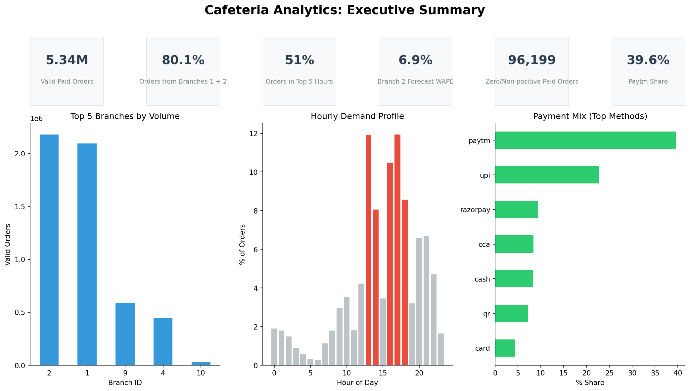
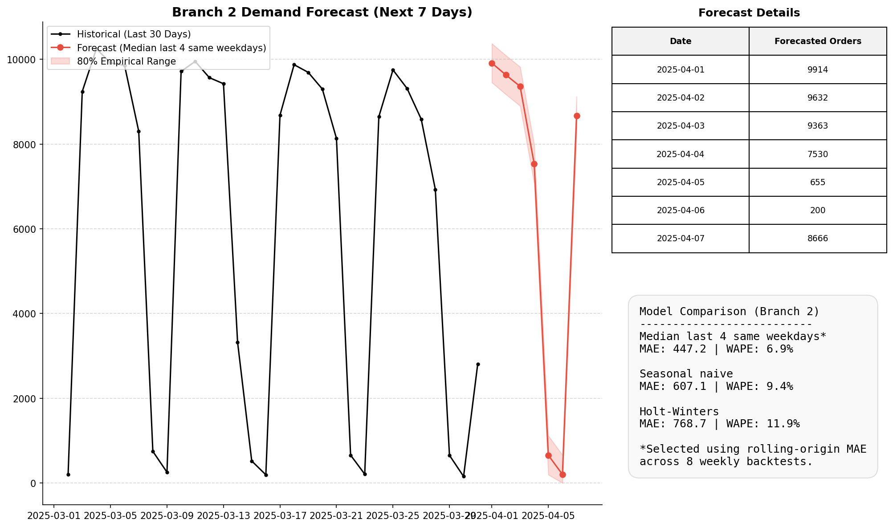

# Cafeteria Order Data: Analysis & 7-Day Forecast

An end-to-end data engineering, EDA, and forecasting pipeline for over 5.3 million cafeteria orders.

## Results at a Glance


## What I Built
- **SQL Extraction**: Streamed and isolated 7 critical tables out of an 11 GB MySQL dump.
- **Cleaning**: Built an automated data cleaning funnel filtering partial-year records and invalid/near-empty branch IDs, filtering down to forecast-valid paid orders.
- **EDA**: Analyzed hourly patterns, branch distributions, payment methods, and non-positive total anomalies.
- **Forecasting**: Evaluated multiple models via 8-fold rolling backtesting, selecting a robust baseline (median of last 4 same weekdays) for the next 7 days.
- **Validation**: Programmatic checks verify key report numbers against pipeline outputs.

## Key Findings
- **Volume Concentration**: Branches 1 and 2 account for 80.1% of all valid orders.
- **Peak Hours**: 51% of demand is concentrated in just 5 hours (13, 14, 16, 17, 18).
- **Weekend Drop-off**: Weekend days average only about 6.6% of weekday volume across branches 1 + 2.
- **Digital Payments**: Digital modes dominate, with Paytm representing 39.6% of orders.
- **Quality Anomalies**: 96,199 paid orders were flagged with zero or non-positive totals; 96,169 of them were mobile-app orders, mostly concentrated in Nov–Dec 2024.

## Forecast


## Quick Review
No dataset or Docker setup is required to review the final results.

Start with:
- Executive Dashboard
- [report.md](report.md)
- `docs/`

## Full Reproduction with Docker

The repository provides a reproducible Docker-based environment for rerunning the analysis from the original assignment SQL dump.

### Prerequisites
- Docker Desktop
- Git
- the assignment-provided SQL dump
- PowerShell on Windows

### Step 1
Clone the repository:
```powershell
git clone <repository-url>
cd cafeteria-forecast
```

### Step 2
The original 11 GB SQL dump is not stored in this repository. For full reproduction, obtain the assignment-provided "Cafeteria Order Data.sql" file and place it at:
`data/Cafeteria Order Data.sql`

### Step 3
Start the reproduction pipeline using the created script.
```powershell
powershell -ExecutionPolicy Bypass -File scripts/reproduce.ps1
```

### Step 4
The pipeline generates:
- `data/processed/`
- `reports/figures/`
- `reports/eda_facts.json`
and validates the results.

## Optional Forecast API

The repository includes a lightweight FastAPI endpoint that serves precomputed 7-day forecasts from the tracked final outputs without importing the full database.

Run:
```powershell
pip install fastapi uvicorn
uvicorn src.api:app --reload
```

Then visit:
`http://127.0.0.1:8000/docs`

Endpoints:
```text
GET /health
GET /forecast?branch=1
GET /forecast?branch=2
```
These return the precomputed final 7-day forecasts.

## Repository Structure

| Path | Purpose |
|---|---|
| `docs/` | Detailed documentation on assumptions, cleaning logs, and methodology |
| `reports/` | Output dashboards, charts, and facts json |
| `reports/final_outputs/` | Lightweight, non-sensitive final artifacts required for review/API demonstration |
| `src/` | Data extraction, cleaning pipeline, EDA, and forecasting scripts |
| `data/processed/` | Locally generated analysis outputs (ignored from Git) |
| `report.md` | Full analytical report |

## Documentation
- [report.md](report.md)
- [docs/README.md](docs/README.md)
- [docs/assumptions.md](docs/assumptions.md)
- [docs/02_cleaning_log.md](docs/02_cleaning_log.md)
- [docs/04_forecast_method.md](docs/04_forecast_method.md)
- [docs/05_model_evaluation.md](docs/05_model_evaluation.md)

## Privacy
`users.sql` contains personal data (emails, password hashes, OTPs). It was not analysed and is not committed.