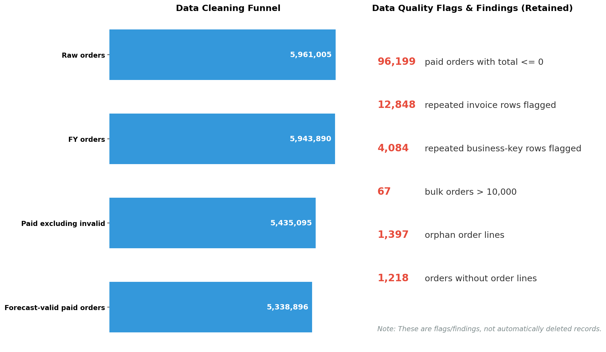
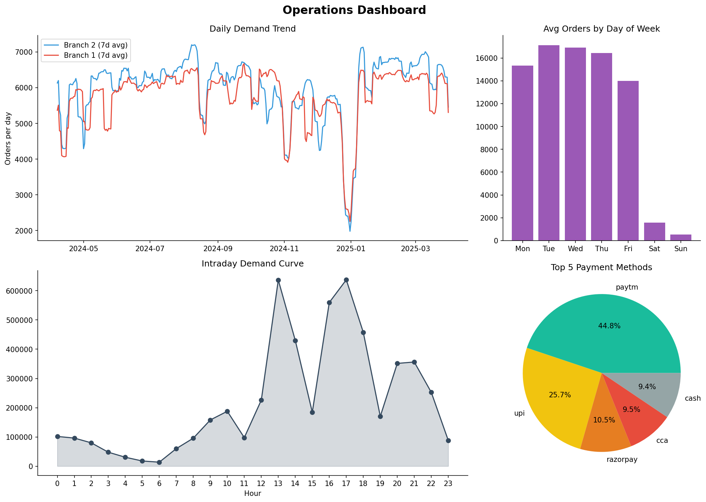
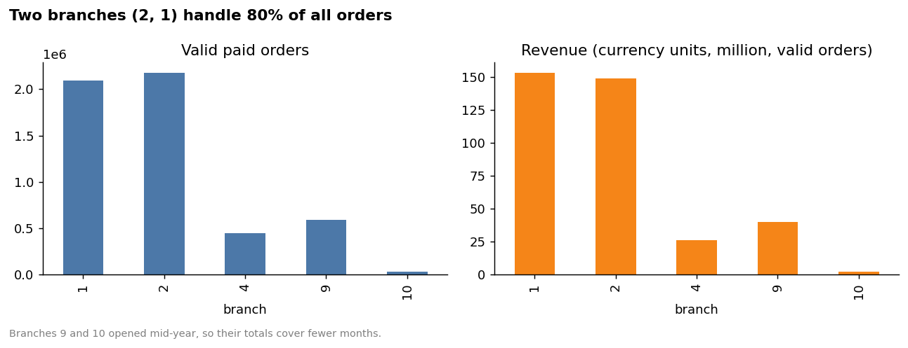
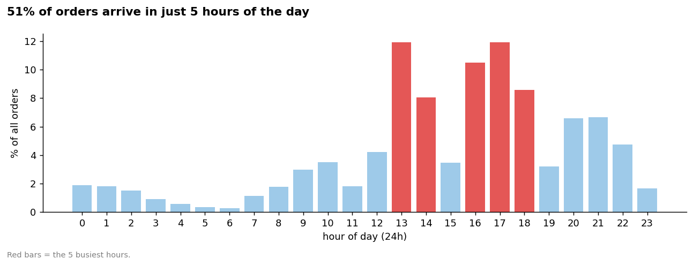
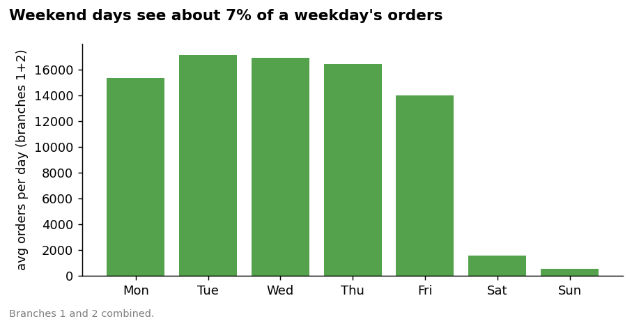
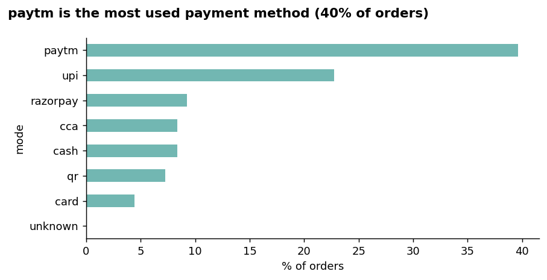
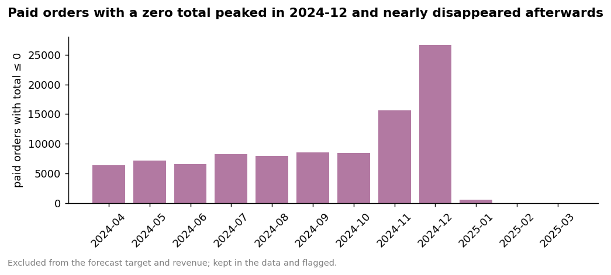
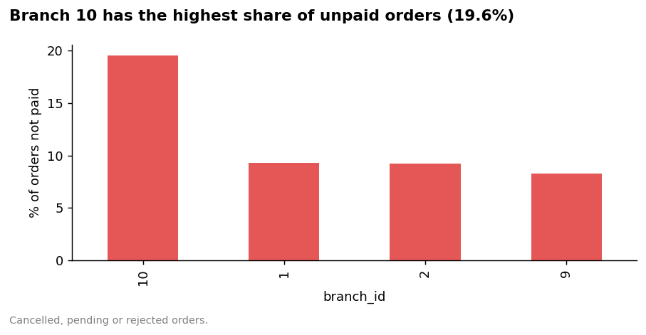

# Cafeteria Order Data: Analysis & 7-Day Forecast
Kanishka Software Pvt Ltd, 24-hour challenge · [Your Name]
Detailed documentation: `docs/` · Reproduce: `README.md`

## Executive Summary

- **Data:** an 11 GB MySQL dump of one financial year (2024-04-01 to 2025-03-31). After cleaning, **5,338,896 valid paid orders** were analysed.
- **Two branches carry the business:** branches 1 and 2 account for **80.1%** of orders.
- **Demand is concentrated:** five hours (13, 14, 16, 17, 18) bring in **51%** of orders; weekend days see only about **7%** of a weekday's volume (branches 1 + 2).
- **Payments are mostly digital:** paytm 39.6%, UPI 22.7%, razorpay 9.3%, cca 8.4%. Cash is 8.3%, QR 7.2%, card 4.4%.
- **Data-quality finding:** 96,199 paid orders (1.8%) have a total of zero or less. 96,169 are mobile-app orders, none with a transaction ID, peaking in Nov-Dec 2024. They are flagged, excluded from the forecast and revenue, and need a source-system check.
- **Forecast (branch 2, next 7 days):** about 9,900 orders on Tuesday, easing to about 7,500 on Friday, nearly empty on the weekend, and about 8,700 on Monday. Backtest error is about **6.9%** (WAPE).

## 1. Data & Approach

| Population | Rows |
|---|---|
| Raw `orders` table | 5,961,005 |
| Financial-year orders | 5,943,890 |
| Paid, excluding branches -1 / 3 / 11 | 5,435,095 |
| **Forecast-valid paid orders (total > 0)** | **5,338,896** |

Only 7 of 70+ tables were needed, so they were extracted from the dump by streaming, loaded into MySQL (Docker) and aggregated in SQL. `order_date` is the order time (a working assumption; see `docs/assumptions.md`). Every exclusion is logged in `docs/02_cleaning_log.md`.

## 2. Data Quality

| Finding | Count | Handling |
|---|---|---|
| Rows after the financial year (partial day, 2025-04-01) | 17,115 | Excluded |
| Branches -1 / 3 / 11 (invalid ID or near-empty) | 438 | Excluded |
| Not paid (cancel / pending / rejected / NULL) | 508,357 | Analysed separately |
| Paid, total ≤ 0 (mostly mobile app, no transaction ID) | 96,199 | Flagged, kept in audit trail, excluded from forecast and revenue |
| `order_number` recycled (402,806 distinct values) | n/a | Not used as a key; `id` is unique |
| Invoice repeated across 2+ **paid** orders | 1,538 groups / 3,336 extra rows | Flagged, not removed (about 0.06% of paid orders) |
| Orders > 10,000 | 67 | Flagged as bulk; backed by large item quantities (e.g. 640, 443, 353 items) |
| Orphan order lines / orders without lines | 1,397 / 1,218 | Documented, not deleted |

## 3. Key Business Insights

**Two branches drive 80.1% of orders.** Branches 9 and 10 opened mid-year (Aug 28, Dec 26), so their totals cover fewer months.

**Five hours bring 51% of orders.** Kitchen and counter capacity matter most in the 13-14 and 16-18 windows.

**Weekends are nearly empty.** Weekend days average about 6.6% of weekday volume across branches 1 + 2. Weekday-weekend staffing should differ sharply.

**Digital payments dominate:** paytm, UPI, cca and razorpay together are about 80% of orders.

**Zero-total paid orders peaked in December 2024** and nearly vanished afterwards. This pattern points to a process or integration problem; the data cannot say which, so it is recommended for source-system review.

**About 9.3% of orders in branches 1 and 2 are not paid** (cancelled, pending, rejected); branch 10 shows 19.6% but is a new branch with a short history.

**Top items (branch 1, by quantity):** Ginger Tea (450,280) sells about 3x the next item, Regular Tea (145,978); Nescafe (94,209) and the Indian Thali Veg Combo (91,986) follow. The same dish appears under several names (e.g. "Indian Thali Veg", "...Veg Combo", "...Combo Veg"), so item rankings understate the true winners until menu names are standardised.

**Low-demand dates.** Among the dates listed, nine show unusually low volume in both branches (2024-04-09, 04-11, 08-15, 11-01, 12-25, 12-26, 12-31, 2025-01-01, 03-31). They are potential closures or reduced operation days; their cause was not verified.

## 4. Forecast

**Target:** daily valid paid orders (Branch 2, 2025-04-01 to 2025-04-07).
**Selected model:** median of the same weekday over the last 4 weeks. In plain terms: predict each weekday from its recent history, so one odd day does not distort the next week.
**Validation:** 8 rolling weekly backtests (each trained only on the past).

| Model | MAE | RMSE | WAPE | Bias |
|---|---|---|---|---|
| **Median of last 4 same weekdays** | **447.2** | 1,120.9 | **6.9%** | -302.9 |
| Seasonal naive (last week) | 607.1 | 1,323.9 | 9.4% | -156.9 |
| Holt-Winters | 768.7 | 1,196.8 | 11.9% | +6.9 |

Holt-Winters has a lower RMSE than seasonal naive, so the ranking depends on the metric; the model was chosen by MAE, and MAPE was dropped because weekend volumes near zero make it unstable. Negative bias means the model slightly over-forecasts on average, partly because the backtest weeks include closure days.

| Date | Day | Forecast | 80% range |
|---|---|---|---|
| 2025-04-01 | Tue | 9,914 | 9,454 - 10,374 |
| 2025-04-02 | Wed | 9,632 | 9,172 - 10,092 |
| 2025-04-03 | Thu | 9,363 | 8,902 - 9,824 |
| 2025-04-04 | Fri | 7,530 | 7,070 - 7,990 |
| 2025-04-05 | Sat | 655 | 194 - 1,116 |
| 2025-04-06 | Sun | 200 | 0 - 660 |
| 2025-04-07 | Mon | 8,666 | 8,206 - 9,126 |

Branch 1 (same method): WAPE 6.7%; Tuesday 8,980, Monday 7,851 (full table in `docs/05_model_evaluation.md`).
**Interval note:** ranges come from the pooled backtest errors, so their width is the same on every day, which is too wide for weekends. They are empirical, not formal confidence intervals.

## 5. Recommendations

1. **Staff and prep to the 13-14 and 16-18 windows;** run a minimal weekend operation.
2. **Audit the zero-total mobile-app orders** (96,169, no transaction ID, peak Dec 2024) with the app/payment team; until then, exclude them from revenue reporting.
3. **Standardise menu item names** so item rankings are reliable.
4. **Maintain a closure/holiday calendar** and feed it to the forecast, since closures are its main error source.
5. **Review the unpaid-order share** (about 9%) by cause; track branch 10 once it has more history.

## 6. Assumptions & Limitations

- One financial year only: no year-over-year seasonality, no external factors (holidays, promotions, weather).
- `order_date` is used as the order time; timezone semantics are not conclusively proven.
- Repeated invoices and business keys are flags, not confirmed duplicates; zero-total orders are not labelled as test, fraudulent or complimentary.
- The forecast is a simple, interpretable 7-day baseline, not a production system.